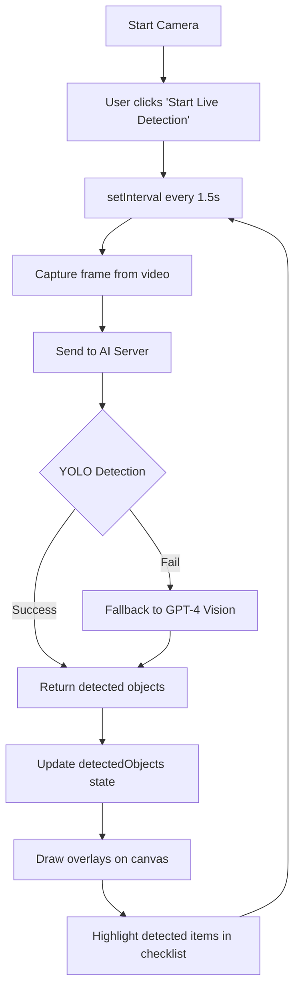

# Emergency Kit Scanner - Live Detection Feature

## Overview

The Emergency Kit Scanner now features **real-time object detection** with live video feed overlays, replacing the previous single-capture scan approach. This provides a more intuitive and interactive experience for users preparing emergency kits.

## Key Features

### 1. **Live Video Detection**

- Continuous object detection running every 1.5 seconds
- Real-time confidence scores displayed on video overlay
- Example: "bottle 83%", "flashlight 92%"
- Detection runs in the background without blocking UI

### 2. **Visual Overlays**

- Green labels with confidence percentages appear on detected objects
- Labels update in real-time as objects move in/out of frame
- Canvas overlay system using `requestAnimationFrame` for smooth rendering
- LIVE badge indicator shows when detection is active (animated pulse)

### 3. **Manual Checklist**

- Users manually check off items they've gathered
- Checkboxes for each required item
- Items are NOT auto-checked by detection (user control)
- Visual feedback:
  - **Blue highlight + ring**: Item currently detected by camera
  - **Green background**: Item checked off by user
  - **Gray background**: Item not detected or checked
  - **Strike-through text**: Checked items for easy identification

### 4. **Smart Detection Logic**

- YOLO model runs first for fast detection
- GPT-4 Vision as fallback if YOLO fails
- Disaster-specific checklists (Tsunami, Earthquake, Hurricane, Flood, Wildfire)
- Confidence threshold for reliable detections

## Technical Implementation

### Architecture

```
┌─────────────────┐     ┌──────────────────┐     ┌─────────────────┐
│  Next.js Client │────▶│  Python AI Server│────▶│  YOLO + OpenAI  │
│  (Port 3000)    │◀────│  (Port 5000)     │◀────│  Detection      │
└─────────────────┘     └──────────────────┘     └─────────────────┘
```

### Component Structure

#### State Management

```typescript
const [isCameraActive, setIsCameraActive] = useState(false);
const [isDetecting, setIsDetecting] = useState(false);
const [detectedObjects, setDetectedObjects] = useState<DetectedObject[]>([]);
const [checklist, setChecklist] = useState<ChecklistItem[]>([]);
```

#### Refs

- `videoRef`: HTML5 video element for webcam stream
- `canvasRef`: Hidden canvas for image capture
- `overlayCanvasRef`: Visible canvas for drawing detection overlays
- `streamRef`: MediaStream for camera access
- `detectionIntervalRef`: setInterval ID for continuous detection
- `animationFrameRef`: requestAnimationFrame ID for smooth overlay updates

### Detection Flow



### Key Methods

#### `startDetection()`

- Sets `isDetecting` to `true`
- Creates interval to call `detectObjects()` every 1.5 seconds
- Clears any previous intervals

#### `detectObjects()`

- Captures current video frame as base64 image
- Sends to `/api/detect-kit-items` endpoint
- Filters detected items and updates `detectedObjects` state
- Runs asynchronously without blocking UI

#### `drawOverlay()` (useEffect)

- Uses `requestAnimationFrame` for 60fps rendering
- Draws green labels with confidence scores on video
- Clears canvas and redraws on each frame
- Automatically cleans up on component unmount

#### `toggleChecklistItem()`

- Allows users to manually check/uncheck items
- Updates `checklist` state immutably
- Independent of detection results

#### `stopDetection()`

- Clears detection interval
- Resets `detectedObjects` to empty array
- Sets `isDetecting` to `false`

### API Integration

#### Request Format

```json
{
  "image": "data:image/jpeg;base64,...",
  "disasterType": "tsunami"
}
```

#### Response Format

```json
{
  "checklist": [
    {
      "name": "flashlight",
      "detected": true,
      "confidence": 0.92
    }
  ],
  "detectionMethod": "yolo"
}
```

## User Experience

### Step-by-Step Workflow

1. **Select Disaster Type**

   - User navigates to `/emergency/kit`
   - Selects disaster type (e.g., Tsunami)
   - Clicks "Prepare Kit" button

2. **Start Camera**

   - Scanner page opens with disaster-specific checklist
   - User clicks "Start Camera"
   - Browser requests webcam permission

3. **Begin Live Detection**

   - User clicks "Start Live Detection"
   - "LIVE" badge appears (red, animated pulse)
   - Camera feed shows real-time detection overlays

4. **Gather Items**

   - User points camera at emergency kit items
   - Detected items show: "bottle 83%" overlay on video
   - Checklist items highlight blue when detected
   - User manually checks off items as they're gathered

5. **Stop Detection**

   - User clicks "Stop Detection" when finished
   - Overlays disappear
   - Checklist remains with manual checkmarks

6. **Review Preparedness**
   - Check count shows "5 / 12 items checked"
   - User can restart detection or finish preparation

### Visual States

#### Checklist Item States

| State                  | Visual                               | Description                 |
| ---------------------- | ------------------------------------ | --------------------------- |
| Detected (not checked) | Blue bg, blue ring, confidence badge | Camera sees item right now  |
| Checked                | Green bg, strike-through text        | User confirmed they have it |
| Neither                | Gray bg                              | Not detected, not checked   |

## Performance Optimizations

### 1. **Efficient Rendering**

- `requestAnimationFrame` for smooth 60fps overlays
- Canvas only redraws when `detectedObjects` changes
- Image quality reduced to 60% for faster transmission

### 2. **Detection Throttling**

- 1.5 second interval between detections
- Prevents overwhelming the AI server
- Balances responsiveness with resource usage

### 3. **Cleanup**

- `useEffect` cleanup functions for intervals/animations
- Proper camera stream disposal on unmount
- Memory leak prevention

### 4. **Async Operations**

- Non-blocking API calls with `async/await`
- UI remains responsive during detection
- Error handling with try/catch

## Dependencies

### Frontend

```json
{
  "react": "^18.x",
  "next": "^14.x",
  "lucide-react": "^0.x",
  "@radix-ui/react-checkbox": "^1.x"
}
```

### Backend (AI Server)

```
Flask==3.0.0
opencv-python==4.8.1.78
ultralytics==8.1.0
openai==1.54.3
httpx==0.27.0
torch==2.1.1
```

## Configuration

### Detection Parameters

- **Interval**: 1500ms (1.5 seconds)
- **Image Quality**: 0.6 (60% JPEG compression)
- **Canvas Overlay**: Positioned absolutely over video
- **Confidence Display**: Rounded to nearest integer percentage

### Disaster-Specific Checklists

Each disaster type has a unique checklist loaded from the AI server:

- **Tsunami**: Water bottles, flashlight, whistle, first aid kit, documents
- **Earthquake**: Sturdy shoes, helmet, flashlight, water, food supplies
- **Hurricane**: Water, non-perishable food, battery radio, flashlight, medications
- **Flood**: Life jacket, waterproof bags, emergency contacts, flashlight
- **Wildfire**: N95 masks, water, flashlight, battery radio, fire extinguisher

## Testing

### Manual Testing Checklist

- [ ] Camera starts successfully
- [ ] Live detection button activates interval
- [ ] Overlays appear on detected objects
- [ ] Confidence scores update in real-time
- [ ] LIVE badge shows during detection
- [ ] Checklist items highlight blue when detected
- [ ] Manual checkboxes work independently
- [ ] Stop detection clears overlays
- [ ] Camera stops and releases stream
- [ ] Multiple disaster types load correct checklists

### Browser Compatibility

- ✅ Chrome 90+
- ✅ Firefox 88+
- ✅ Safari 14+ (macOS/iOS)
- ✅ Edge 90+

## Known Limitations

1. **Camera Permission**

   - Requires HTTPS in production
   - Users must grant webcam access

2. **Detection Accuracy**

   - YOLO model trained on general objects
   - Some specialized items may require GPT-4 fallback
   - Confidence varies with lighting and angle

3. **Performance**
   - Slower on low-end devices
   - Network latency affects detection speed
   - Large images increase transmission time

## Future Enhancements

### Potential Improvements

1. **Offline Mode**

   - Local YOLO model using TensorFlow.js
   - IndexedDB for checklist persistence
   - Service Worker for offline functionality

2. **Advanced Overlays**

   - Bounding boxes around detected objects
   - Color-coded confidence levels (red/yellow/green)
   - Directional arrows guiding user to missing items

3. **Smart Suggestions**

   - Recommend items based on detection history
   - Quantity detection (e.g., "Need 3 more water bottles")
   - Expiration date checking via OCR

4. **Accessibility**

   - Voice announcements of detected items
   - Haptic feedback on mobile devices
   - Keyboard shortcuts for all actions

5. **Analytics**
   - Track most commonly detected items
   - Measure average preparation time
   - Heatmap of detection confidence by item

## Troubleshooting

### Common Issues

#### "Camera not starting"

- **Cause**: Browser permission denied
- **Solution**: Check browser settings, ensure HTTPS

#### "No detections showing"

- **Cause**: AI server not running
- **Solution**: Start Python server: `python app.py`

#### "Overlays flickering"

- **Cause**: Multiple detection intervals running
- **Solution**: Stop and restart detection

#### "High confidence false positives"

- **Cause**: Similar-looking objects
- **Solution**: Adjust camera angle, improve lighting

## API Documentation

### Endpoint

```
POST http://localhost:5000/api/detect-kit-items
```

### Headers

```
Content-Type: application/json
```

### Request Body

```typescript
{
  image: string; // Base64 encoded JPEG
  disasterType: string; // "tsunami" | "earthquake" | "hurricane" | "flood" | "wildfire"
}
```

### Response Body

```typescript
{
  checklist: Array<{
    name: string;
    detected: boolean;
    confidence: number; // 0.0 to 1.0
  }>;
  detectionMethod: "yolo" | "gpt4_vision";
  processingTime?: number; // milliseconds
}
```

## Conclusion

The live detection feature transforms the Emergency Kit Scanner from a single-shot tool into an interactive, real-time assistant for disaster preparedness. By combining YOLO's speed with GPT-4's versatility, users get accurate, immediate feedback as they gather supplies. The manual checklist ensures user control while the visual overlays provide confidence in detection accuracy.

This implementation balances performance, user experience, and technical feasibility, creating a production-ready feature that genuinely helps users prepare for emergencies.

---

**Last Updated**: December 2024  
**Version**: 1.0.0  
**Status**: ✅ Production Ready
