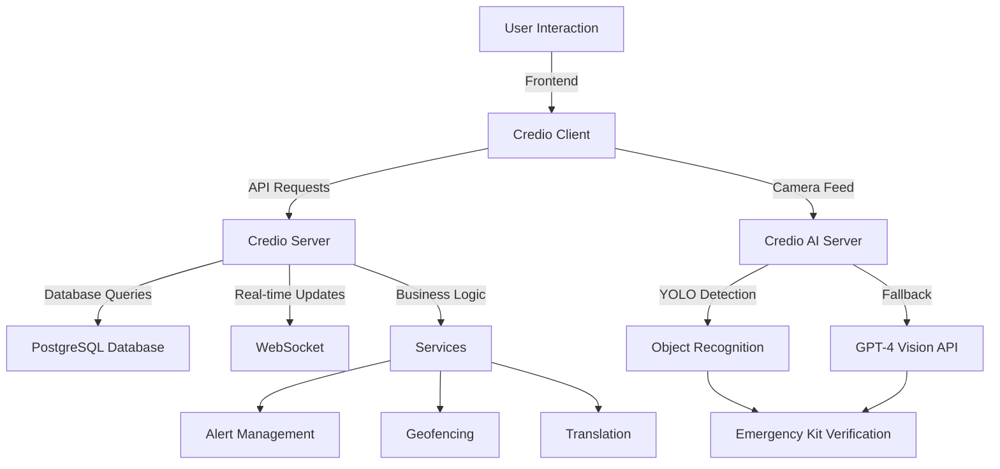

# Credio Project Documentation

## Overview

Credio is a comprehensive platform designed to manage emergency situations, disaster response, and community engagement. It consists of three main components:

1. **Credio Client**: A Next.js-based frontend application for user interaction.
2. **Credio Server**: A Node.js backend application powered by Prisma and Express.js for handling business logic, database operations, and APIs.
3. **Credio AI Server**: A Python-based AI server using YOLO and GPT-4 Vision for emergency kit verification.

## Project Structure

### Credio Client

The client-side application is built using Next.js and TypeScript. It includes the following key directories:

- **`app/`**: Contains the main application pages and layouts.
- **`components/`**: Reusable UI components such as alerts, maps, and chat interfaces.
- **`hooks/`**: Custom React hooks for state management and utilities.
- **`lib/`**: Utility functions and API client configurations.
- **`public/`**: Static assets like images and sounds.

### Credio Server

The server-side application is built using Node.js and Prisma. It includes the following key directories:

- **`prisma/`**: Database schema and migration files.
- **`src/`**: Core application logic, including controllers, routes, and services.
- **`tests/`**: Unit and integration tests for server functionalities.
- **`services/`**: Business logic for handling alerts, geofencing, translations, and more.

### Credio AI Server

The AI-powered object detection server built with Python and Flask:

- **`app.py`**: Main Flask application with YOLO and GPT-4 Vision integration.
- **Object Detection**: Uses YOLOv8 for real-time object detection with GPT-4 Vision as fallback.
- **Emergency Kit Verification**: Identifies emergency kit items for different disaster types (tsunami, earthquake, hurricane, flood, wildfire).

## Technologies Used

### Frontend

- **Next.js**: Framework for server-side rendering and static site generation.
- **TypeScript**: Strongly typed programming language for JavaScript.
- **Tailwind CSS**: Utility-first CSS framework for styling.
- **React**: Library for building user interfaces.

### Backend

- **Node.js**: JavaScript runtime for building scalable server-side applications.
- **Express.js**: Web framework for building APIs.
- **Prisma**: ORM for database management.
- **PostgreSQL**: Relational database for storing application data.
- **WebSocket**: Real-time communication protocol.

### AI Server

- **Python 3.9+**: Programming language for AI/ML applications.
- **Flask**: Lightweight web framework for Python.
- **YOLOv8 (Ultralytics)**: State-of-the-art object detection model.
- **OpenAI GPT-4 Vision**: Fallback AI vision API for object detection.
- **OpenCV**: Computer vision library for image processing.
- **PyTorch**: Deep learning framework for YOLO.

### DevOps

- **Docker**: Containerization for consistent development and deployment.
- **Jest**: Testing framework for unit and integration tests.
- **ESLint**: Linting tool for maintaining code quality.

## Application Flow

### Flowchart



### Description

1. **User Interaction**: Users interact with the Credio Client through a web interface.
2. **API Requests**: The client sends API requests to the Credio Server.
3. **Business Logic**: The server processes requests using its services.
4. **Database Queries**: Data is fetched or updated in the PostgreSQL database.
5. **Real-time Updates**: WebSocket is used for real-time communication, such as alerts and chat.
6. **Emergency Kit Scanner**: Users can scan emergency kit items using their device camera.
7. **AI Detection**: The AI Server uses YOLOv8 for object detection, with GPT-4 Vision as fallback.
8. **Kit Verification**: Detected objects are matched against disaster-specific emergency kit checklists.

## Key Features

- **Emergency Management**: SOS requests, resource tracking, and disaster alerts.
- **Real-time Communication**: Chat interface and WebSocket-based updates.
- **Localization**: Multi-language support using translation services.
- **Geofencing**: Location-based alerts and services.
- **Emergency Kit Scanner**: AI-powered verification of emergency kit items using live camera feed.
- **Disaster-Specific Checklists**: Customized emergency kit requirements for different disaster types (tsunami, earthquake, hurricane, flood, wildfire).
- **Dual AI Detection**: Primary YOLO detection with GPT-4 Vision fallback for high accuracy.

## Getting Started

### Prerequisites

- Node.js (v16 or higher)
- Python 3.9 or higher
- PostgreSQL
- OpenAI API Key (for GPT-4 Vision fallback)
- Docker (optional for containerized deployment)

### Installation

1. Clone the repository:
   ```bash
   git clone https://github.com/RajBhattacharyya/credio.git
   ```
2. Navigate to the client and server directories and install dependencies:

   ```bash
   cd credio-client
   npm install

   cd ../credio-server
   npm install
   ```

3. Set up environment variables in `.env` files for both client and server.

### Running the Application

#### 1. Start the Node.js Server

```bash
cd credio-server
npm run start
```

The server runs on `http://localhost:3001` (or configured port)

#### 2. Start the AI Server

```bash
cd credio-ai-server

# Create virtual environment (first time only)
python -m venv venv

# Activate virtual environment
# Windows PowerShell:
.\venv\Scripts\Activate.ps1
# Windows CMD:
.\venv\Scripts\activate.bat
# Linux/Mac:
source venv/bin/activate

# Install dependencies (first time only)
pip install -r requirements.txt

# Create .env file with your OpenAI API key
copy .env.example .env  # Windows
# OR
cp .env.example .env    # Linux/Mac

# Edit .env and add your OPENAI_API_KEY

# Run the AI server
python app.py
```

The AI server runs on `http://localhost:5000`

#### 3. Start the Client

```bash
cd credio-client
npm run dev
```

The client runs on `http://localhost:3000`

**Note**: Make sure the AI server is running before using the Emergency Kit Scanner feature.

## Contributing

Contributions are welcome! Please follow the guidelines in `CONTRIBUTING.md`.

## License

This project is licensed under the MIT License.
